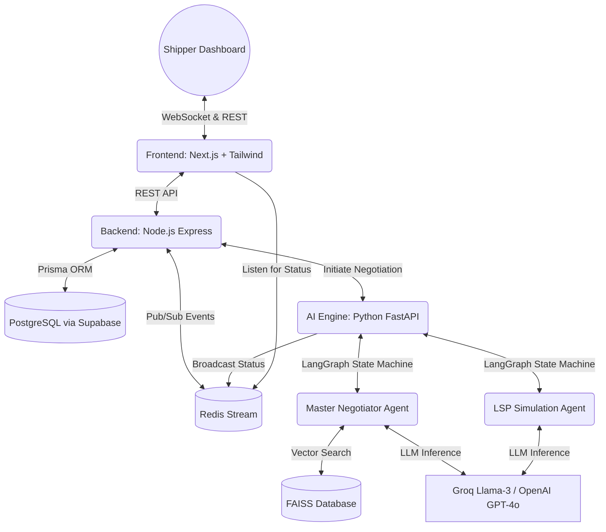

<div align="center">
  
  
  
  
  
  
  
  
  

  <br><br>

  <h1>🤝 NEGOTIARA AI</h1>
  <p><strong>The Elite Freight Negotiation Engine Powered by Multi-Agent AI</strong></p>

  <p>
    <a href="#about-the-project">About The Project</a> •
    <a href="#negotiation-philosophy">Philosophy</a> •
    <a href="#system-architecture">Architecture</a> •
    <a href="#tech-stack">Tech Stack</a>
  </p>
</div>

---

## 🚀 About The Project

Negotiara AI is an enterprise-grade, multi-agent artificial intelligence system designed to secure the best possible freight rates for shippers.

Rather than acting as a simple chatbot or a blind low-balling algorithm, Negotiara incorporates the psychological, mathematical, and strategic philosophies of the world's greatest negotiators. It evaluates market conditions, tracks conversation history, implements dynamic anchoring, and streams the entire decision-process through real-time websockets.

The goal? **Maximizing savings while maintaining collaborative and professional long-term LSP (Logistics Service Provider) partnerships.**

---

## 🧠 The 5-Pillar Negotiation Philosophy

Our `Master Negotiator` agent simultaneously processes internal directives derived from:

1. **📈 Warren Buffett (Value & Safety):** Anchors aggressively but rationally. Never accepts a deal without a clear margin of safety against market benchmarks.
2. **🛡️ George Soros (Adaptive Strategy):** Continuously leverages competitor quotes and adapts to the risk of the counterpart walking away.
3. **🤝 Chris Voss (Tactical Empathy):** Uses psychological mirroring and calibrated "How" or "What" questions to disarm hostility and guide the counterpart.
4. **📐 Ed Brodow (Structured Discipline):** Adheres to a strict concession curve. Never gives a concession without extracting value in return. Must maintain the discipline to walk away at the absolute Reservation Price.
5. **🕊️ Kwame Christian (Collaborative Mindset):** Approaches the entire loop as win-win problem-solving to ensure long-term trust.

---

## 🏗️ System Architecture

Negotiara operates on a highly scalable, distributed Multi-Service architecture designed for real-time inference and streaming.



---

## 💻 Elite Tech Stack

Negotiara separates intensive LLM routing from business logic through a specialized microservice architecture:

### Frontend
- **Framework:** Next.js (App Router)
- **Styling:** Tailwind CSS + Radix/Shadcn (Premium Aesthetics)
- **Real-time:** `socket.io-client` for live negotiation streaming

### Backend API
- **Runtime:** Node.js + Express
- **Database ORM:** Prisma
- **Database:** PostgreSQL (Hosted via Supabase)
- **Streaming & Pub/Sub:** Redis + Socket.io Server

### AI Core Engine
- **API Framework:** Python FastAPI
- **LLM Routing:** LangGraph (Stateful graph execution)
- **Intelligence Search:** FAISS (For querying similar historical negotiation benchmarks)
- **Text Generation:** Groq API (Running ultra-fast open source models like Llama-3) or OpenAI.

---

## 📂 Monorepo Structure

```text
📦 NEGOTIARA AI
 ┣ 📂 frontend        # Next.js Application (React UI)
 ┣ 📂 backend         # Node.js Express Server (Postgres/Redis hooks)
 ┃ ┣ 📂 prisma        # DB Schemas
 ┃ ┗ 📜 server.js
 ┗ 📂 ai-engine       # Python Microservice
   ┣ 📂 agents        # MasterNegotiator & LspAgent classes 
   ┣ 📂 engine        # LangGraph State Machine definitions
   ┣ 📂 intelligence  # Negotiation memory and FAISS Vector DB
   ┣ 📂 prompts       # Persona and JSON constraints for LLMs
   ┣ 📂 strategy      # Anchoring, Concession step logic and BATNA metrics
   ┗ 📜 app.py        # FastAPI entrypoint exposing inference routes
```

---

## 🛠️ Setup & Local Development

*(Ensure you have Node.js 18+, Python 3.10+, and Redis installed locally).*

**1. Clone the repository**
```bash
git clone https://github.com/Samy-in/Negotiara.git
cd Negotiara
```

**2. Setup AI Engine (Python)**
```bash
cd ai-engine
python -m venv venv
source venv/bin/activate  # On Windows: venv\Scripts\activate
pip install -r requirements.txt
# Add a .env file with your GROQ_API_KEY
uvicorn app:app --reload --port 8000
```

**3. Setup Backend (Node.js)**
```bash
cd ../backend
npm install
# Add a .env file with your DATABASE_URL (Supabase/Postgres)
npx prisma db push
npm run start
```

**4. Setup Frontend (Next.js)**
```bash
cd ../frontend
npm install
npm run dev
```

The unified dashboard will be available at `http://localhost:3000`.

---
<div align="center">
  <i>"In business, you don't get what you deserve, you get what you negotiate." - Chester L. Karrass</i>
</div>
# Negotiara-AI
  